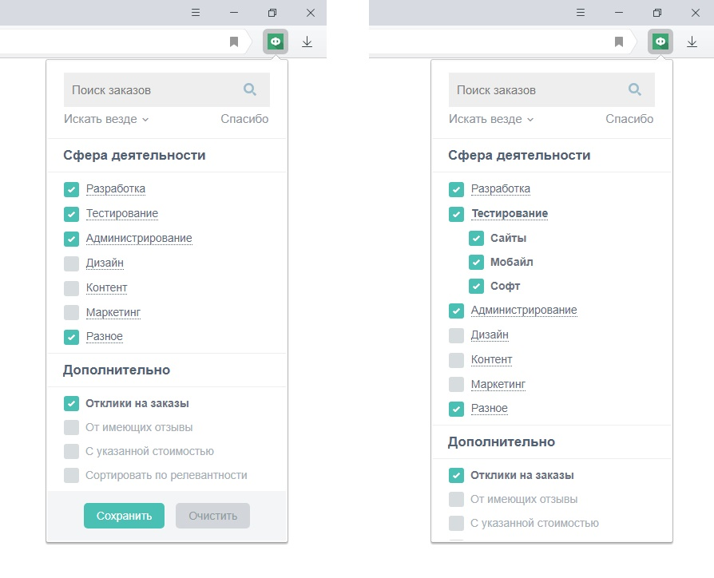
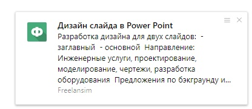

# Freelansim

Я достаточно давно использую платформу для свободного труда — [freelansim.ru](https://freelansim.ru). Она приносит мне достаточно не плохой доход, решил сделать этот плагин для сайта [freelansim.ru](https://freelansim.ru) и опубликовать его, потому что хочу чтобы люди экономили время друг друга и вообще так удобней работать всем. Нет, я не боюсь конкуренции. Вот мой профиль на freelansim: **[JSusDev](https://freelansim.ru/freelancers/jsusdev)**, обращайтесь!

А и еще вы можете мне **[пожертвовать](https://jsusdev.github.io/home-page/donate.html)** какую-нибудь сумму за мои труды, спасибо.

### Обзор плагина 
Я посторался полностью скопировать оригинальное меню страницы поиска хоть это было и не так просто.

Также я добавил пункт **Отклики на заказы**, если вы авторизованы вам будут приходить сообщения о том что есть новый отклик.

Плагин проверяет сервис на новые задачи и отклики каждые *30 секунд*.

Уведомления о новых задачах.

### Поддержка
-  telegram: @jsusdev
-  email: jsusdev@yandex.ru
-  skype: live:jsusdev

### Контакты

Мой Телегам: @JSusDev, канал https://t.me/Jsusdevs

если у вас есть какие-либо вопросы и/или предложения, пожалуйста, напишите мне в телеграмме, если вы найдете ошибки я буду очень благодарен, также дайте мне знать.

